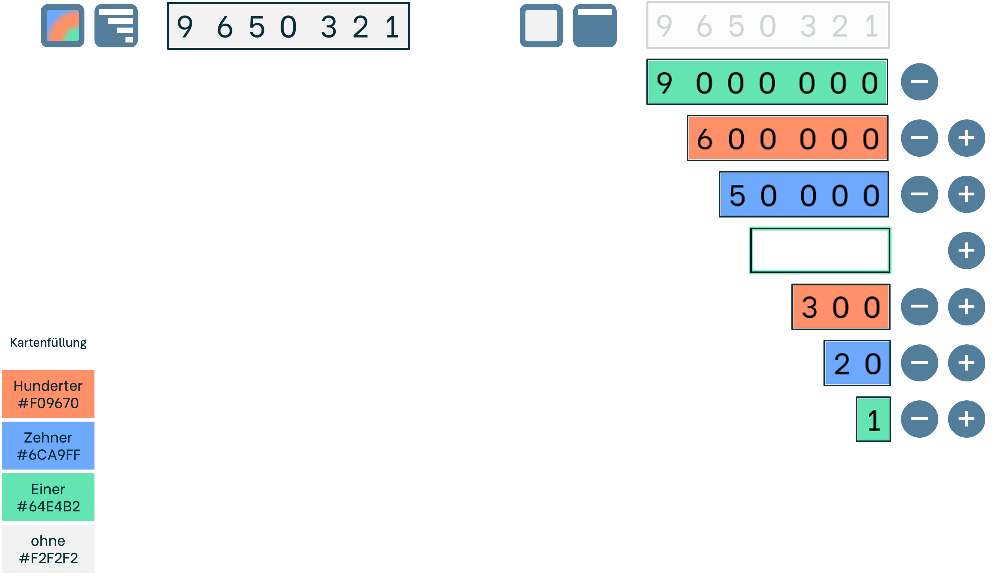

# Spezifikation numbercards 2
Mail, Yannick, 12.12.2024

Dass die Weiterentwicklung parallel laufen kann, finden wir gut; wir hätten tatsächlich auch noch ein paar optische Anpasungswünsche, einmal als Bild zusammengestellt:

- *DONE*: 
den Färben-Button hattest du ja schon angesprochen. Falls die Form dieser Farbpalette zu blöd ist, mit Cindy selbst zu machen, wären wir natürlich auch offen für alternativ-Vorschläge. Spontan könnte ich mir auch einen quadratischen Button mit so einem Farbverlauf o.ä. vorstellen.
    - Kommentar: Kein Farbverlauf, nur 3 Kreise

- *DONE*: die Farbe der Karten in der Komponente passt noch nicht ganz. Hier hätten wir gerne die im Bild angegebenen Farben. Die sind etwas kräftiger, aber bei Farbblindheit besser zu erkennen.

- *DONE*: Die Strichstärke in der Komponente ist aktuell etwas zu dick. Das liegt vmtl. daran, dass das alles etwas kleiner skaliert ist, als in Ullis Demo? Wäre gut, wenn die Strichstärke etwas näher an der Darstellung im Bild wäre. Vllt Stärke 1 für die ausgeklappten Karten, Stärke 2 für die zugeklappten.

- Wir hätten gerne die „Lücken“ zwischen Million & Hunderttausender sowie Tausender & Hunderter. Idealerweise via Editor ein-/ausstellbar. Noch idealerer, wenn man zwischen Leerstelle, Punkten und „keine Lücke“ wählen könnte.

- In der Komponente liegen die Ziffern nicht ganz zentriert in den Karten. Bitte vertikal zentrieren, wenn möglich.

Dann hätten wir nur noch einmal eine Frage: welchen Font hast du für die Ziffernkarten genutzt? Wir finden den schön und würden den gerne in unseren Lernvideos verwenden, in denen wir die Zahlenbau-Karten nachbauen.

Hoffe es ist alles verständlich, bei Rückfragen zu den Punkten gerne melden.
