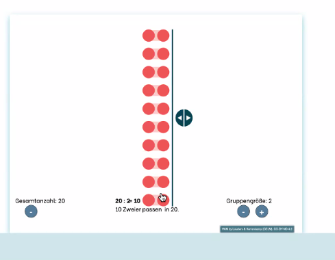
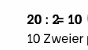
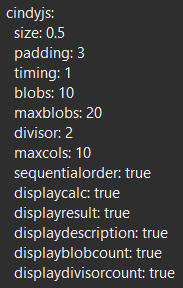

strapworks:
- **?** IST DAS DIE AKTUELLSTE VERSION???? ES GEHT NIX
- **erledigt** Polygone gleichgroß machen (keine Prio)
- **erledigt** Polygone in der Mitte ausrichten
- **erledigt** Mustercontainer ausblendbar

numbercards:
- **erledigt** Zahlenkarte zeigt weiterhin Farben der Boxen überlappt an, wenn zusammengeklappt
- **??** Farbbutton 
  - **erledigt** Zustände/aussehen umdrehen
  - **das auch???** uch wenn Farben aus Button farbig, aber mit Kreuz durch

divisors:
- **erledigt** Buttons ausstellbar konfigurieren
- Blobs überlagern Text
  - 
- **erledigt** Lücken in Text größer
  - 
- Bug: Schieberegler ändert bei festem Zustand nicht mehr die Gruppengröße
  - 
  - liegt vllt an "maxcols"

übergeordnet:
- 

https://outermedia.atlassian.net/wiki/spaces/DIVOMATH/pages/1808433209/CindyJS+-+Anforderungen